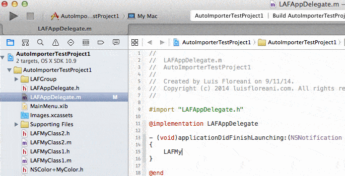

# Auto Importer for Xcode

Quickly import your headers on the fly without having to manually go to the top of your file and type the import statement.

## Features

- Allows to import a class/protocol/category header by selecting some text matching its name.
- Allows to import from a list of all classes/protocols/categories and headers in your project.

## Prerequisites

- Xcode 6

## Install

#### Alcatraz

- Install [Alcatraz](https://github.com/supermarin/Alcatraz) and search for **Auto-Importer** 

#### Manual

- Clone and build the project, then restart Xcode.

## Usage

- ⌘ + ctrl + H after selecting some text (or you can have no selection at all)
- If the selected text matches the name of a class/protocol or category method, it will import the header and you're done, otherwise it will show a list of filtered identifiers and headers...
- start typing the keyword of your import
- use ↑ or ↓ keys to navigate
- press ↵ or double click to add an import

NOTE: on the list, classes are shown as [C], protocols as [P] and category methods as [ClassExtended()]

## Uninstall

Run `rm -r ~/Library/Application\ Support/Developer/Shared/Xcode/Plug-ins/AutoImporter.xcplugin/`

## Known Issues

- If you get an error alert while typing the shortcut, it may be because of a bad bundle build, so delete `~/Library/Application Support/Alcatraz/Plug-ins/Auto-Importer`, `~/Library/Application Support/Developer/Shared/Xcode/Plug-ins/Auto-Importer` and `~/library/Developer/Xcode/DerivedData/*` and reinstall from scratch.
- When two workspaces (and thus two windows) are open, there is no distinction between workspaces and all identifiers are shown on the listing.
- Avoid using 'InstallApplicationEventHandler' since it prevent other plugins to use it.

## Dependencies

- **XcodeEditor** https://github.com/jasperblues/XcodeEditor

## Roadmap

- Read headers from frameworks.

## Misc

Thanks to the [Peckham](https://github.com/markohlebar/Peckham.git) project since I used some pieces from it.

## About Citrusbyte

This software is lovingly maintained and funded by Citrusbyte.
At Citrusbyte, we specialize in solving difficult computer science problems for startups and the enterprise.

At Citrusbyte we believe in and support open source software.
* Check out more of our open source software at Citrusbyte Labs.
* Learn more about [our work](https://citrusbyte.com/portfolio).
* [Hire us](https://citrusbyte.com/contact) to work on your project.
* [Want to join the team?](http://careers.citrusbyte.com)

*Citrusbyte and the Citrusbyte logo are trademarks or registered trademarks of Citrusbyte, LLC.*
